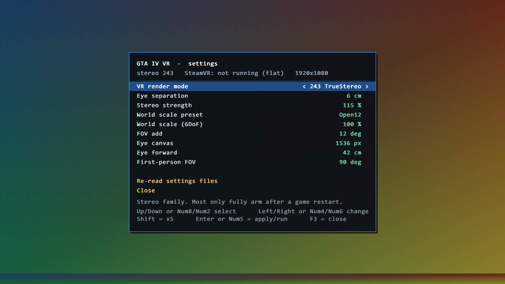

# In-game settings overlay — branch `menu-integration`



`docs/MENU_INTEGRATION.md` (written offline by Fable 5) asks whether the VR render
mode can be swapped from GTA IV's own pause menu. Its answer: yes, but the real
row needs a FusionFix preference-table patch, and judging any of it needs a
headset.

This branch takes the other route. **The mod draws its own panel into the frame.**
No table patch, no `frontend_menus.xml`, no FusionFix dependency — and it is
visible on a plain monitor with no headset connected, which is the whole point
right now.

---

## What you get

| | |
|---|---|
| **F3** | open / close the overlay |
| **Up / Down** or **Num8 / Num2** | move the selection |
| **Left / Right** or **Num4 / Num6** | change the value (hold **Shift** for ×5 steps) |
| **Enter** or **Num5** | run the selected action |
| **F4** | cycle the VR render profile without opening anything (unchanged) |

Every change is applied live **and** written to the same `gtaiv_dxvk_vr.*` file
that the matching F5..F11 hotkey writes, so settings survive a restart and the
menu can never disagree with the hotkeys.

Rows: VR render mode, eye separation, stereo strength, world-scale preset,
world scale (6DoF), FOV add, eye canvas, eye forward, first-person FOV, plus
"re-read settings files" and "close".

The render-mode row lists the shipped milestones by name — `243 TrueStereo`,
`170 Clean`, `53 AER`, `0 Flat`. Override the whole list with
`gtaiv_dxvk_vr.menumap` (one `value=stereoMode` per line) rather than editing
the source; the file is read once at startup, so a game restart picks it up
without redeploying the ASI.

**Kill switch:** put a single `0` in `gtaiv_dxvk_vr.menu` next to the ASI. The
overlay then never allocates, never polls keys and never touches device state.

---

## Testing it on flat (no headset)

SteamVR does not need to be running. Stereo mode `0` is fine.

1. Build and deploy:

```bash
powershell -File scripts/build-asi.ps1
```

```bash
powershell -File scripts/deploy-asi.ps1 -GameDir "C:\Program Files (x86)\Steam\steamapps\common\Grand Theft Auto IV\GTAIV"
```

2. Start GTA IV, get into the game (not the loading screen), press **F3**.
3. The panel should appear centred on screen. The status line tells you the live
   stereo mode, whether SteamVR is connected, and the backbuffer size.
4. Move with Down, change with Left/Right. Watch two things:
   * `gtaiv_dxvk_vr.log` next to the EXE gets one line per change.
   * the sidecar files change on disk — e.g. `gtaiv_dxvk_vr.ipd`,
     `gtaiv_dxvk_vr.stereoscale`, `gtaiv_dxvk_vr.fovadd`, `gtaiv_dxvk_vr.scale`.
5. Close with F3. The game image must be **unchanged** — no leftover tint,
   no missing HUD, no washed-out colours. That is the state save/restore check.

What flat testing does *not* prove: whether the values themselves do anything.
Most of them only have a visible effect in a headset. Flat proves the menu —
rendering, navigation, persistence, and that the overlay leaves the game's
render state exactly as it found it.

### Testing it without launching the game at all

`tools/menu_preview` builds the real overlay against a plain D3D9 device and
writes a BMP:

```bash
powershell -File scripts/build-menu-preview.ps1
```

```bash
./out-preview/menu_preview.exe 1920 1080 out-preview/shot.bmp
```

The bottom 40 px of the output are cleared to magenta *before* the overlay draws
and painted over by the harness's own gradient *after* it. **Any magenta left in
the image means the overlay leaked device state.** The two screenshots in this
folder were produced this way.

---

## How it works

Three new translation units, wired in at one place.

| File | Role |
|---|---|
| `src/asi/menu_draw.cpp` | 2D renderer: GDI-baked glyph atlas in one `D3DPOOL_MANAGED` A8R8G8B8 texture, pre-transformed (XYZRHW) quads, one `DrawPrimitiveUP` per frame, manual device-state save/restore |
| `src/asi/vr_menu.cpp` | the menu itself: row table, keyboard handling, layout |
| `src/asi/menu_bridge.cpp` | the render-profile list shared by the overlay and F4 |
| `src/asi/stereo_config.{h,cpp}` | new `Menu*` accessors — thin wrappers over the same set+save pairs the F5..F11 cyclers use |
| `src/asi/hooks.cpp` | one call, first thing in `HookEndScene` |

### Why the draw sits where it does

```cpp
HRESULT STDMETHODCALLTYPE HookEndScene(IDirect3DDevice9* self) {
  asi::VrMenuOnEndScene(self);   // <-- here
  asi::TryMonoSubmit(self);
  return g_realEndScene(self);
}
```

* It has to be **before `g_realEndScene`**: `DrawPrimitive*` is only legal inside
  a `BeginScene`/`EndScene` pair. `HookPresent` runs outside the scene entirely.
* It has to be **outside `TryMonoSubmit`**: that function early-returns when
  there is no headset, so anything inside it is dead on a flat machine. Every
  existing hotkey poll (F5..F11) lives inside it — which is exactly why none of
  them work with VR off.
* It has to be **before `TryMonoSubmit`**: that function reads the backbuffer and
  submits it to both eyes. Drawing first means one draw reaches the monitor and
  the headset.

### Why the renderer is hand-rolled

The ASI links `d3d9.lib` only and there is no legacy DirectX SDK on the machine,
so `ID3DXFont` / `ID3DXSprite` are unavailable — they would need the SDK at build
time and `d3dx9_43.dll` at run time. GDI + a texture atlas + `DrawPrimitiveUP` has
no such dependency. (`gdi32.lib` had to be added to the link line.)

### Why state is saved by hand instead of with a state block

`CreateStateBlock` is documented as illegal between `BeginScene` and `EndScene`,
and this renderer runs exactly there. `menu_draw.cpp` saves the render states,
texture-stage states, sampler states, shader/FVF/declaration bindings, stream 0,
the index buffer, render target, depth-stencil surface and viewport by hand, and
restores them in reverse. `DrawPrimitiveUP` nulls stream 0 and the index buffer
per the D3D9 spec, so those are restored unconditionally — including back to null.

`D3DRS_SRGBWRITEENABLE` and `D3DSAMP_SRGBTEXTURE` are forced off, because the mod
submits with `vr::ColorSpace_Gamma`; an sRGB write state left on by the game would
double-correct the overlay.

---

## Known gap: the overlay is monitor-only on the DrawWalk dual modes

Modes **200 / 203 / 204 / 241 / 242 / 243** — including Mode 243, the current
checkpoint — do not capture the eyes at `EndScene`. `HookDrawWalk`
(`stereo_render.cpp`, exe RVA `0x4D8BF0`) runs the render walk twice and copies
the backbuffer into `g_texL` / `g_texR` *during* the walk, long before
`HookEndScene` is reached.

So on those modes the overlay appears **on the monitor but not in the headset**.
On stereo mode 0, on the mono submit path, and on the EndScene-capture modes
(129–135 and the temporal family) it appears in both.

The fix is a second draw site inside `StereoTrySubmitEyes` — after the
`if (!g_haveL || !g_haveR) return false;` gate and **before**
`interop->FlushRenderingCommands()` / `LockSubmissionQueue()` — binding
`g_texL`/`g_texR` as the render target in turn and drawing the same panel into
each. That is deliberately **not** done here: it cannot be judged without a
headset, and it touches the most delicate code in the project. See
`PROGRESS.md`.

---

## What is not on this branch

The FusionFix preference poll from `docs/MENU_INTEGRATION.md` section 2 (Layer D
— reading `PREF_*` through the chained `GET_NUMBER_OF_INSTANCES_OF_STREAMED_SCRIPT`
native) is **not** here. It invokes a GTA IV script native, and natives must not
be called from the EndScene thread. This base has no game-thread tick to host it.
It stays on `claude/mode-244-render-pose`, where `cam_matrix.cpp` provides the
site next to `TickAimFromGameThread`.

The profile list format (`gtaiv_dxvk_vr.menumap`, `value=stereoMode` per line) is
kept byte-compatible with it, so the two merge cleanly.
